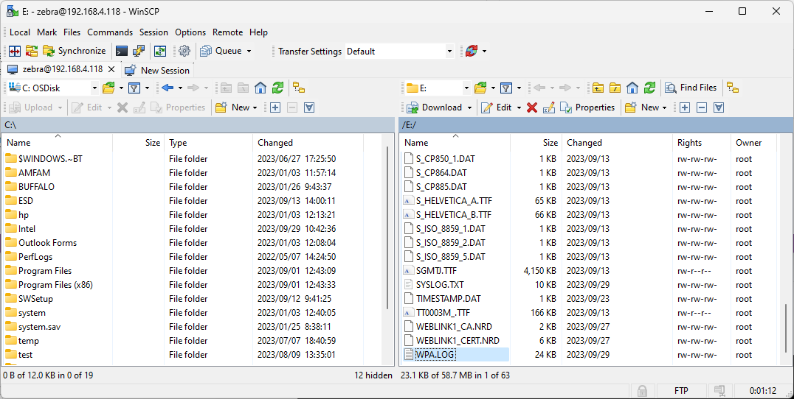

# Zebra-Printer_Trouble-Shooting_Set-and-Collect-Wireless-Trace-Log
 トラブル時に取得すべきプリンタの設定情報（Wi-Fiのログ版）

詳細は下記リンクを参照。  
https://supportcommunity.zebra.com/s/article/Capturing-WPA-Roam-Logging-For-A-Link-OS-Compatible-Printers?language=en_US

 

### WPA.LOG/ROAM.LOG 設定方法

1. Zebra Setup Utility を起動。

1. 対象のプリンタを選択。 

    

1. [Open Communication with Printer] を選択。

1. 下記コマンコマンドを実行。

        ! U1 setvar "wlan.roam.monitor" "file" 
        ! U1 setvar "wlan.wpa.debug_log" "on" 
        ! U1 do "device.reset" "" 

        ※ コマンドの最終行に必ずEnter(CR/LF)を入れること！

1. プリンタが再起動する。  
    ※ 再起動しない場合は手順を見直して、手順を最初から再実行。

 

### WPA.LOG/ROAM.LOG 設定確認方法

1. 下記コマンコマンドを実行。

        ! U1 do "file.dir" "E:WPA.LOG"

1. 下記コマンドを実行し、E:WPA.LOGが存在することを確認する。

        ! U1 do "file.dir" "E"

    ▼ 返り値

        - DIR E:*.* 
        * E:ANMDJ.TTF  22927536          
        * E:CGTRI_N.FNT     45407          
        -- 略
        * E:WEBLINK1_CA.NRD      2024  P       
        * E:WEBLINK1_CERT.NRD      5349  P       
        * E:WPA.LOG     23557          ★

 

### WPA.LOG/ROAM.LOG取得方法 (FTPを用いる方法)

1. FTPクライアントでプリンタに接続し、WPA.LOG/ROAM.LOG*をダウンロードください。

    \* ROAM.LOGはNW環境によっては作成されないことがあります。

        Default User: zebra  
        Default Pass: 1234

    ▼ 例、WinSCPにてプリンタに接続

    

 

### WPA.LOG/ROAM.LOG削除方法

WPA.LOGは時間経過と比例して、ファイルサイズが大きくなります。プリンタのドライブ容量が枯渇する前に定期的に削除ください。

1. 下記コマンコマンドを実行。

        ! U1 do "file.delete" "E:WPA.LOG"
        ! U1 do "file.delete" "E:ROAM.LOG"

1. 下記コマンドを実行し、WPA.LOG/ROAM.LOGが存在しないことを確認する。

        ! U1 do "file.dir" "E"

 

### WPA.LOG/ROAM.LOG 設定無効化方法

1. 下記コマンコマンドを実行。

        ! U1 setvar "wlan.roam.monitor" "off" 
        ! U1 setvar "wlan.wpa.debug_log" "off"

1. 下記コマンコマンドを実行。

        ! U1 do "file.delete" "E:WPA.LOG"
        ! U1 do "file.delete" "E:ROAM.LOG"

1. 下記コマンドを実行し、WPA.LOG/ROAM.LOGが存在しないことを確認する。

        ! U1 do "file.dir" "E"
